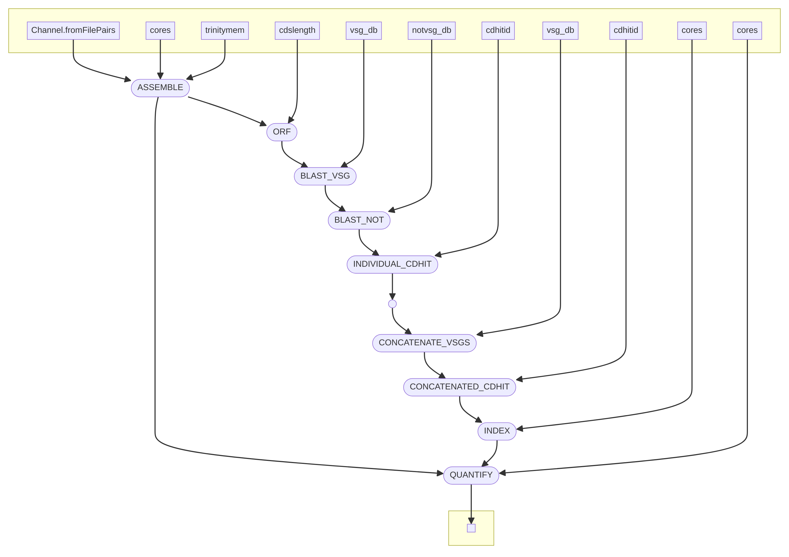

# vsgseq2
An updated  pipeline for analysing VSG-seq data. The original VSGSeq pipeline is described in this [paper](https://www.ncbi.nlm.nih.gov/pmc/articles/PMC4514441/) and [repository](https://github.com/mugnierlab/VSGSeqPipeline).

## Installation  
```
git clone https://github.com/goldrieve/vsgseq2.git
cd vsgseq2
conda env create --file vsgseq2.yml -n vsgseq2
conda activate vsgseq2
```

## Quick start 
vsgseq2 is implemented using Nextflow, which is installed as part of the vsgseq2.yml. The vsgseq2 pipeline is split into two commands:
1) assembly
2) analyse 

To test the installation, I created synthetic Illumina data for 5 'samples' which are stored in data/reads/(1-5_1.fq.gz 1-5_2.fq.gz). These paired end fastq files were synthesised with bbmap, using 10 transcripts as a reference (4 VSGs and 6 random _T. brucei_ transcripts).

To run vsgseq2 on the tutorial data, simply enter

```
nextflow run assemble.nf --outdir tutorial_results
nextflow run analyse.nf --assemblies 'tutorial_results/assemblies/*_trinity.Trinity.fasta' --reads 'tutorial_results/trimmed_reads/*{1,2}.fq.gz' --outdir tutorial_results
```

This will create the directory __tutorial_results__ which will contain 4 subdirectories

1) VSGs - VSGs predicted for each sample (e.g. 1_VSGs.fasta).  
        - concatenated list of all assembled VSGs (concatenated_vsgs.fasta). 
        - final VSG database, after removing duplicate VSGs with cd-hit (VSGome.fasta).
2) assemblies - Trinity assembly for each sample.
3) summary - salmon alingment information (multiqc_report.html).
           - quantification summary for each sample (tpm.csv).
           - predicted VSG count for each sample (vsg_count.csv).
4) trimmed_reads - trimmed reads for each sample.

To visualise the expression data and number of assembled VSGs, use the R script bin/plot_script.R
Running the code will produce the figure below


```
|======================================|
| V S G S E Q 2 - N F - A S S E M B L E|
|======================================|

VSGSEQ2.nf: A pipeline for analysing VSGSeq data

Required arguments:

  --reads Location of reads, if not in reads dir
                [default: /Users/goldriev/pkgs/vsgseq2/data/reads/*{1,2}.fq.gz]

Optional arguments:

  --requestedcpus  Define number of cores VSGSeq2 will use.
                [default: 4]
  --cores  Define number of cores Trinity will use.
                [default: 4]
  --trinitymem    Define mem Trinity will use.
                [default: 20]
  --outdir        VSGSeq outdir.
                [default: results]
  --help         Print this message.
```

```
|====================================|
| V S G S E Q 2 - A N A L Y S E - N F|
|====================================|

VSGSEQ2.nf: A pipeline for analysing VSGSeq data

Required arguments:

  --assemblies Location of assemblies
                [default: /Users/goldriev/pkgs/vsgseq2/assemblies/*_trinity.Trinity.fasta]
  --reads Location of reads, if not in reads dir
                [default: /Users/goldriev/pkgs/vsgseq2/data/reads/*{1,2}.fq.gz]
  --vsg_db    Location of VSGdb
                [default: /Users/goldriev/pkgs/vsgseq2/data/blastdb/concatAnTattb427.fa]
  --NOTVSG_db Location of NOTVSGdb
                [default: /Users/goldriev/pkgs/vsgseq2/data/blastdb/NOTvsgs.fa]

Optional arguments:

  --requestedcpus  Define number of cores VSGSeq2 will use.
                [default: 1]
  --cores  Define number of cores Trinity will use.
                [default: 1]
  --cdslength    Define minimium CDS length (amino acids).
                [default: 300]
  --cdhitid       Define sequence identiy threshold - how much the alignment has to match (0.0 - 1.0).
                [default: 0.98]
  --outdir        VSGSeq outdir.
                [default: results]
  --help         Print this message.
```
## DAG



## Dependencies

Dependencies should be installed using the conda yml found in the Git repository.


## Input Files

assemble.nf has been updated to allow to submissiong of paired-end sequencing reads, in FASTQ format. Place the FASTQ files in the directory data/reads and the pipeline will do the rest. If you want to run the pipeline on a subset of these reads, add the following flag specifiying the location and names of files you would like to analyse.
```
--reads 'dir/*{1,2}.fq.gz'
``` 

## Output Files

Output files are saved in one folder. A summary file shows the expression of each VSG in each sample, both in terms of TPM and percentage of the population (TPM for that VSG/total TPM).

