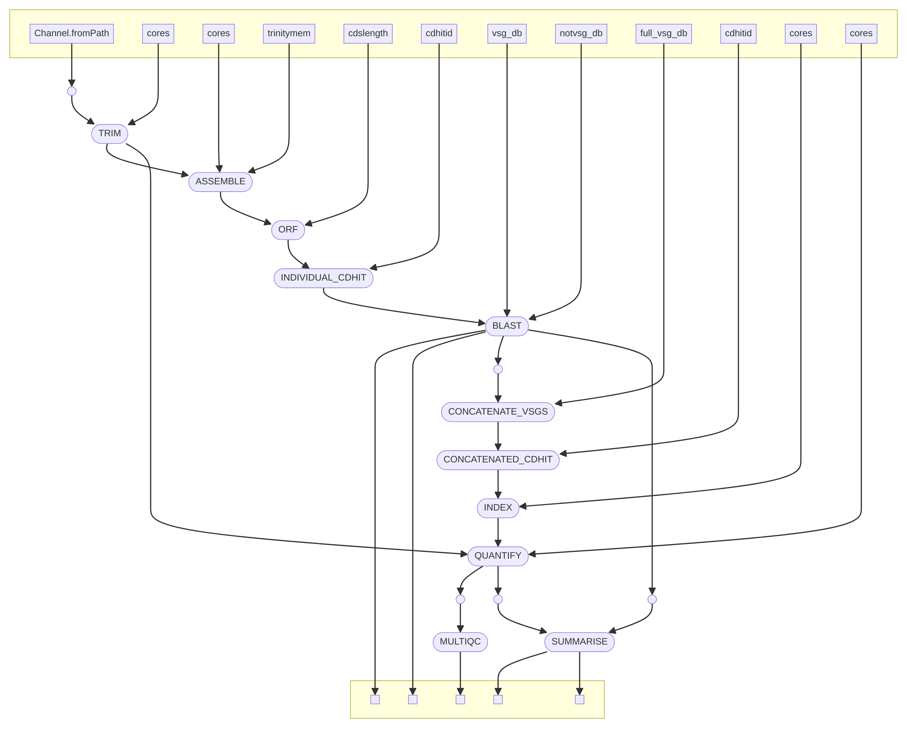

# vsgseq2

An updated pipeline for analyzing VSG-seq data. The original VSGSeq pipeline is described in this [paper](https://www.ncbi.nlm.nih.gov/pmc/articles/PMC4514441/) and [repository](https://github.com/mugnierlab/VSGSeqPipeline).

## Installation and Environment Setup

We use Conda to manage the environment. Please ensure you are using a recent version of Conda (Anaconda 2024.02 and Conda 24.3.0 are recommended).

```
git clone https://github.com/goldrieve/vsgseq2.git
cd vsgseq2
conda env create --file vsgseq2.yml -n vsgseq2
conda activate vsgseq2
```

## Input Files

main.nf takes both single and paired-end sequencing reads, in FASTQ format. Define the location of the reads in the samplesheet.csv and start the run!

## Quick start 
vsgseq2 is implemented using Nextflow, which is installed as part of the vsgseq2.yml.
To test the installation, use synthetic Illumina data for six samples which are stored in data/reads:
- Paired reads:2 early, 2 late.
- Single end reads: 1 early and 1 late.

To run vsgseq2 on the tutorial data, simply enter

```
nextflow run main.nf --outdir tutorial_results
```

This will create the directory __tutorial_results__ which will contain 4 subdirectories

1) VSGs 
- VSGs predicted for each sample (e.g. 1_VSGs.fasta).  
- concatenated list of all assembled VSGs (concatenated_vsgs.fasta). 
- final VSG database, after removing duplicate VSGs with cd-hit (VSGome.fasta).

2) assemblies 
- Trinity assembly for each sample.

3) summary 
- salmon alignment information (multiqc_report.html).
- quantification summary for each sample (tpm.csv).
- predicted VSG count for each sample (vsg_count.csv).

4) trimmed_reads 
- trimmed reads for each sample.

To visualise the expression data and number of assembled VSGs, use the R script bin/plot_script.R
Running the code will produce the figure below


## vsgseq2 structure
The dag below summarises each step of vsgseq2.



## Customising analysis
It is possible to run sections of vsgseq2 using the --mode flag. The default is to run the whole pipeline, but say you have assembled the transcripts during a first run and wish to change a single flag in the analysis section, you can feed in the pre-assembled transcripts and start the pipeline from the analysis section. 

The default tutorial data run, including all vsgseq2 steps:
```
nextflow run main.nf --outdir tutorial_results
```

This is the same as running:
```
nextflow run main.nf --outdir tutorial_results --mode full
```

If you want to run the assembly step alone:
```
nextflow run main.nf --outdir tutorial_results --mode assemble
```

To run the entire analysis steps, post assembly:
```
nextflow run main.nf --outdir tutorial_results --mode analyse
```

The analyse steps can be broken down even further.
To predict VSGs from assemblies:
```
nextflow run main.nf --outdir tutorial_results --mode predictvsgs
```

To quantify the expression of predicted VSGs:
```
nextflow run main.nf --outdir tutorial_results --mode quantify
```

## Edit the pipeline execution using the following flags
```
VSGSEQ2.nf: A pipeline for analysing VSGSeq data

Required arguments:

  --assemblies Location of assemblies
                [default: data/tutorial_assemblies/*_trinity.Trinity.fasta]
  --vsg_db    Location of VSGdb
                [default: data/blastdb/concatAnTattb427.fa]
  --notvsg_db Location of NOTVSGdb
                [default: data/blastdb/NOTvsgs.fa]
  --vsgome    Location of VSGome
                [default: data/blastdb/concatAnTattb427.fa]
  --full_vsg_db    Location of a database to add into the VSGome (such as data/blastdb/concatAnTattb427_full.fa).
                    Default will only include the assembled VSGome.
  --mode    The mode to run the pipeline in. Options are full, assemble, predictvsgs, quantify, analyse.
                [default: full]


Optional arguments:

  --requestedcpus  Define number of cores VSGSeq2 will use.
                [default: 4]
  --cores  Define number of cores Trinity and other tools will use.
                [default: 4]
  --trinitymem  Define memory amount for Trinity in Gb.
                [default: 20 Gb]
  --cdslength    Define minimum CDS length (amino acids).
                [default: 300]
  --cdhitid       Define sequence identity threshold - how much the alignment has to match (0.0 - 1.0).
                [default: 0.98]
  --outdir        VSGSeq output directory.
                [default: results]
  --samplesheet  Define the path to the samplesheet.
                [default: samplesheet.csv]
  --help         Print this message.
  ```