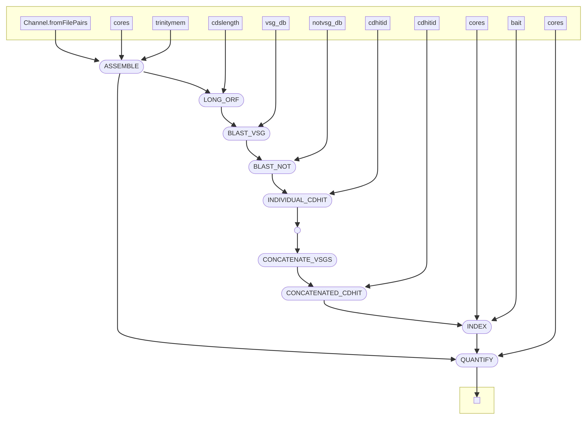

# vsgseq2
An updated  pipeline for analysing VSG-seq data. Originally described in this [paper](https://www.ncbi.nlm.nih.gov/pmc/articles/PMC4514441/).

## Installation 
```
git clone https://github.com/goldrieve/vsgseq2.git
cd vsgseq2
conda env create --file vsgseq2.yml -n vsgseq2
conda activate vsgseq2
nextflow run assemble.nf
nextflow run analyse.nf
```

As the Trinity assembly stage takes substantially longer to run than the analyse step, I have split these to processes into two nextflow files. You can assemble your transcripts and then run analysis, with rapid changes to settings if required.

```
|======================================|
| V S G S E Q 2 - N F - A S S E M B L E|
|======================================|

VSGSEQ2.nf: A pipeline for analysing VSGSeq data

Required arguments:

  --reads Location of reads, if not in reads dir
                [default: /Users/goldriev/pkgs/vsgseq2/data/reads/*{1,2}.fq.gz]

Optional arguments:

  --requestedcpus  Define number of cores VSGSeq2 will use.
                [default: 4]
  --cores  Define number of cores Trinity will use.
                [default: 4]
  --trinitymem    Define mem Trinity will use.
                [default: 20]
  --outdir        VSGSeq outdir.
                [default: results]
  --help         Print this message.
```

```
|====================================|
| V S G S E Q 2 - A N A L Y S E - N F|
|====================================|

VSGSEQ2.nf: A pipeline for analysing VSGSeq data

Required arguments:

  --assemblies Location of assemblies
                [default: /Users/goldriev/pkgs/vsgseq2/assemblies/*_trinity.Trinity.fasta]
  --reads Location of reads, if not in reads dir
                [default: /Users/goldriev/pkgs/vsgseq2/data/reads/*{1,2}.fq.gz]
  --vsg_db    Location of VSGdb
                [default: /Users/goldriev/pkgs/vsgseq2/data/blastdb/concatAnTattb427.fa]
  --NOTVSG_db Location of NOTVSGdb
                [default: /Users/goldriev/pkgs/vsgseq2/data/blastdb/NOTvsgs.fa]

Optional arguments:

  --requestedcpus  Define number of cores VSGSeq2 will use.
                [default: 1]
  --cores  Define number of cores Trinity will use.
                [default: 1]
  --cdslength    Define minimium CDS length (amino acids).
                [default: 300]
  --cdhitid       Define sequence identiy threshold - how much the alignment has to match (0.0 - 1.0).
                [default: 0.98]
  --outdir        VSGSeq outdir.
                [default: results]
  --help         Print this message.
```
## DAG



## Dependencies

Dependencies should be installed using the conda yml found in the Git repository.


## Input Files

assemble.nf has been updated to allow to submissiong of paired-end sequencing reads, in FASTQ format. Place the FASTQ files in the directory data/reads and the pipeline will do the rest. If you want to run the pipeline on a subset of these reads, add the following flag specifiying the location and names of files you would like to analyse.
```
--reads 'dir/*{1,2}.fq.gz'
``` 

## Output Files

Output files are saved in one folder. A summary file shows the expression of each VSG in each sample, both in terms of TPM and percentage of the population (TPM for that VSG/total TPM).

