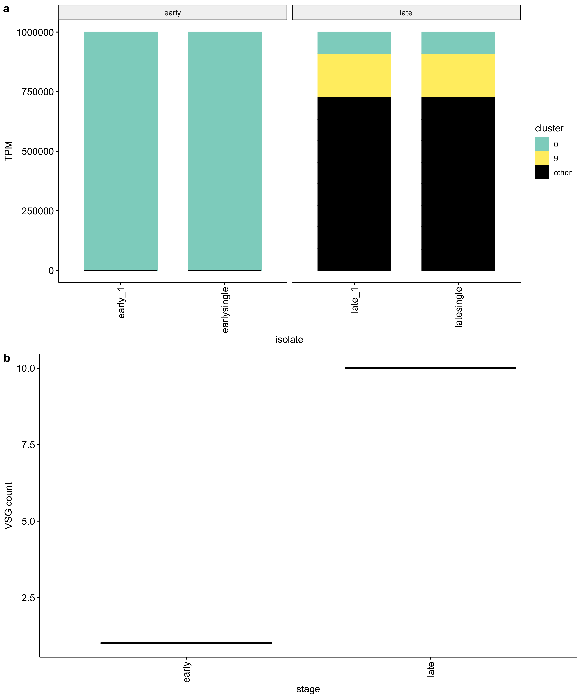
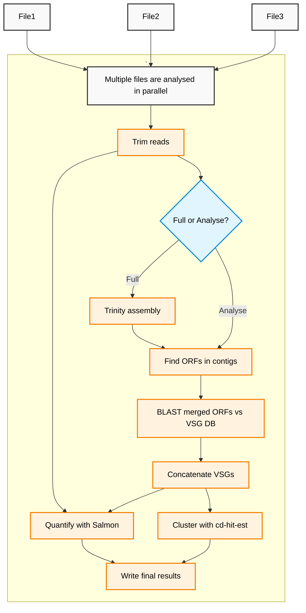

# vsgseq2

An updated pipeline for analyzing VSG-seq data. The original VSGSeq pipeline is described in this [paper](https://www.ncbi.nlm.nih.gov/pmc/articles/PMC4514441/) and [repository](https://github.com/mugnierlab/VSGSeqPipeline).

## Installation

We use Nextflow to run vsgseq2. There are two methods of installing Nextflow/vsgseq2, both asseume conda in pre-installed.

1) Manual vsgseq2 installation:

```
git clone https://github.com/goldrieve/vsgseq2
cd vsgseq2/
conda env create -f vsgseq2.yml
conda activate vsgseq2-env
nextflow run main.nf --help

# You can test the installation with synthetic VSGSeq data
cd data/reads 
nextflow run ../../main.nf --samplesheet samples.csv --outdir results/tutorial
```

2) Installation via Nextflow:

```
conda create --name nf-env bioconda::nextflow
nextflow run goldrieve/vsgseq2 -r main --help

# You can test the installation with synthetic VSGSeq data
wget https://github.com/goldrieve/vsgseq2/raw/refs/heads/main/data/reads.tar.xz
tar -xf reads.tar.xz
cd reads 
nextflow run goldrieve/vsgseq2 -r main -with-conda --samplesheet samples.csv --outdir results/tutorial
```

## Example results

1. VSGs/
- {sample}_VSGs.fasta - Predicted VSG sequences per sample
- concatenated_vsgs.fasta - All assembled VSGs combined
- VSGome.fasta - Non-redundant VSG database after cd-hit clustering
2. assemblies/
- {sample}_trinity.Trinity.fasta - De novo transcriptome assemblies
- {sample}_trinity.Trinity.fasta.gene_trans_map - Gene-transcript mappings
3. summary/
- tpm/
  - tpm.csv - Raw Transcripts Per Million quantification
  - filtered_tpm.csv - Filtered TPM based on read threshold
  - cluster_tpm.csv - TPM values aggregated by VSG clusters
- read_counts/
  - num_reads.csv - Number of reads per VSG
  - total_read_counts.csv - Total read counts per sample
vsgs/
- vsg_count.csv - Number of unique VSGs per sample
- cluster/
  - filtered_tpm_clusters.csv - TPM with cluster assignments
  - filtered_tpm_clusters_length.csv - TPM with clusters and sequence lengths
  - cluster_champion.csv - Representative VSGs for each cluster
  - champion_vsgs.fasta - Sequences of representative VSGs
- length/
  -length.csv - Sequence length information for VSGs
4. trimmed_reads/
- {sample}_trimmed.fq.gz - Quality and adapter trimmed reads


Tutorial plot


## vsgseq2 structure
The dag below summarises each step of vsgseq2.



## Customising analysis
It is possible to run sections of vsgseq2 using the --mode flag. The default is to run the whole pipeline, but say you have assembled the transcripts during a first run and wish to change a single flag in the analysis section, you can feed in the pre-assembled transcripts and start the pipeline from the analysis section. 

For example, if you installed vsgseq2 manually, the default run would analyse the data fully:

```
nextflow run ../../main.nf --mode full --samplesheet samples.csv --outdir results/tutorial
```
However, you can re-use the trinity assembly and re-run the analysis steps with modifications, such as editing the read alignment threshold:

```
nextflow run ../../main.nf --mode analyse --samplesheet samples.csv --assemblies 'results/tutorial/assemblies/*_trinity.Trinity.fasta' --threshold 200000 --outdir results/tutorial_200000
```

## Edit the pipeline execution using the following flags
```
VSGSEQ2.nf: A pipeline for analysing VSGSeq data

Required arguments:

  --assemblies Location of assemblies
                [default: *_trinity.Trinity.fasta]
  --vsg_db    Location of VSGdb
                [default: vsgseq2/data/blastdb/concatAnTattb427.fa]
  --notvsg_db Location of NOTVSGdb
                [default: vsgseq2/data/blastdb/vsgseq2NOTvsgs.fa]
  --vsgome    Location of VSGome
                [default: vsgseq2/data/blastdb/concatAnTattb427.fa]
  --full_vsg_db    Location of a database to add into the VSGome (such as data/blastdb/concatAnTattb427_full.fa).
                    Default will only include the assembled VSGome.
  --mode    The mode to run the pipeline in. Options are full, analyse.
                [default: full]
  --outdir        VSGSeq output directory.
                [default: results/20250604_160730]
  --samplesheet  Define the path to the samplesheet.
                [default: vsgseq2/data/reads/samples.csv]


Optional arguments:

  --requestedcpus  Define number of cores VSGSeq2 will use.
                [default: 4]
  --cores  Define number of cores Trinity and other tools will use.
                [default: 4]
  --trinitymem  Define memory amount for Trinity in Gb.
                [default: 20 Gb]
  --cdslength    Define minimum CDS length (amino acids).
                [default: 300]
  --cdhit_id       Define sequence identity threshold - how much the alignment has to match (0.0 - 1.0).
                [default: 0.94]
  --cdhit_as       Define alignment coverage for the shorter sequence (0.0 - 1.0).
                [default: 0.94]
  --threshold       Define the lowest number of reads a sample must have mapped to the VSGome to include in the filtered tpm.csv.
                [default: 100000]
  --help         Print this message.
  ```