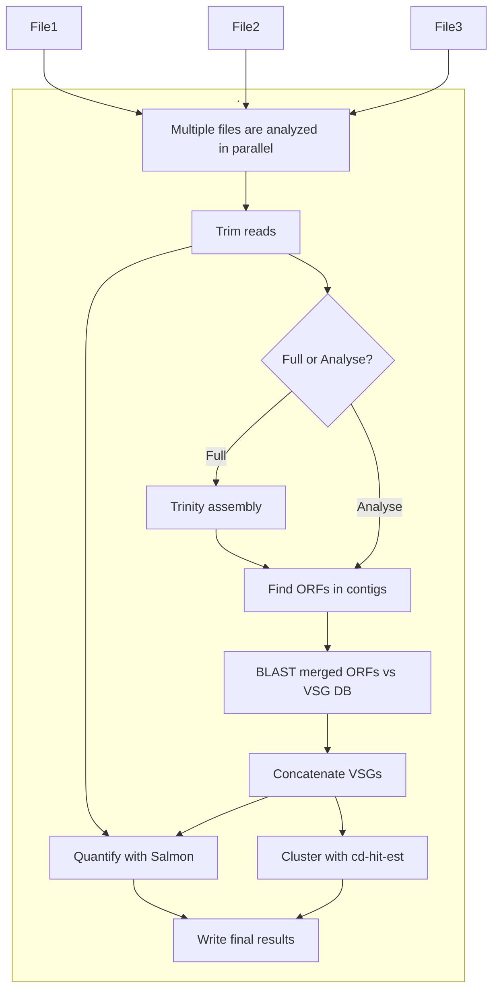

# vsgseq2

**vsgseq2** is an updated pipeline for analyzing VSG-seq data, based on the original VSGSeq pipeline described in [this paper](https://www.ncbi.nlm.nih.gov/pmc/articles/PMC4514441/) and [repository](https://github.com/mugnierlab/VSGSeqPipeline).

## Installation

This pipeline is built using [Nextflow](https://www.nextflow.io/). You can install and run **vsgseq2** in two main ways. Both methods assume that **Conda** is pre-installed.

### 1. Manual installation

```bash
git clone https://github.com/goldrieve/vsgseq2
cd vsgseq2/
conda env create -f vsgseq2.yml
conda activate vsgseq2-env
nextflow run main.nf --help
```

To test the installation using synthetic data:

```bash
cd data/reads
nextflow run ../../main.nf --samplesheet samples.csv --outdir results/tutorial
```

### 2. Installation via Nextflow

```bash
conda create --name nf-env bioconda::nextflow
conda activate nf-env
nextflow run goldrieve/vsgseq2 -r main --help
```

To test with example data:

```bash
wget https://github.com/goldrieve/vsgseq2/raw/refs/heads/main/data/reads.tar.xz
tar -xf reads.tar.xz
cd reads
nextflow run goldrieve/vsgseq2 -r main -with-conda --samplesheet samples.csv --outdir results/tutorial
```

## Example Output

After running the tutorial data, output files are organized into the following directories:

### 1. `VSGs/`

* `{sample}_ORF_VSGs.fasta` – Predicted VSG ORF sequences per sample
* `concatenated_vsgs.fasta` – All assembled VSGs from all samples
* `VSGome/`

  * `VSGome.fasta` – Clustered VSG database using cd-hit-est
  * `VSGome.fasta.clstr` – Summary of clustering results

### 2. `assemblies/`

* `{sample}_trinity.Trinity.fasta` – De novo transcriptome assemblies

### 3. `summary/`

* `cluster/`

  * `filtered_tpm_clusters.csv` – TPM values with cluster assignments
  * `filtered_tpm_clusters_length.csv` – As above with sequence lengths
  * `cluster_champion.csv` – Representative VSGs per cluster
  * `champion_vsgs.fasta` – Sequences of representative VSGs
* `length/`

  * `length.csv` – Sequence length data
* `multiqc_report.html` – Summary of quantification (Salmon)
* `read_counts/`

  * `num_reads.csv` – Read counts per VSG
  * `total_read_counts.csv` – Total reads per sample
* `tpm/`

  * `tpm.csv` – Raw TPM values
  * `filtered_tpm.csv` – TPM values filtered by read threshold
  * `cluster_tpm.csv` – Cluster-level TPMs
* `vsgs/`

  * `vsg_count.csv` – Number of unique VSGs per sample

### 4. `trimmed/`

* `{sample}_trimmed.fq.gz` – Quality- and adapter-trimmed reads

To generate a summary figure from `cluster_tpm.csv`, run the R script `bin/plot_script.py`. It should produce this plot:


## Pipeline Overview

Below is a simplified DAG of the vsgseq2 pipeline:



## Running Specific Pipeline Sections

Use the `--mode` flag to control which parts of the pipeline are executed.

* `full` (default): Run the entire pipeline from raw reads
* `analyse`: Use pre-assembled transcripts to rerun downstream analyses

### Example

Run the full pipeline:

```bash
nextflow run ../../main.nf --mode full --samplesheet samples.csv --outdir results/tutorial
```

Re-use Trinity assemblies and re-run the analysis section with a new threshold:

```bash
nextflow run ../../main.nf \
  --mode analyse \
  --samplesheet samples.csv \
  --assemblies 'results/tutorial/assemblies/*_trinity.Trinity.fasta' \
  --threshold 200000 \
  --outdir results/tutorial_200000
```

## Command-line Options

**Required arguments:**

```text
--assemblies      Location of transcript assemblies
                  [default: *_trinity.Trinity.fasta]
--vsg_db          Location of VSG BLAST database
                  [default: data/blastdb/concatAnTattb427.fa]
--notvsg_db       Location of non-VSG BLAST database
                  [default: data/blastdb/vsgseq2NOTvsgs.fa]
--vsgome          Location of VSGome file
                  [default: data/blastdb/concatAnTattb427.fa]
--full_vsg_db     Additional database to add to VSGome
                  [default: none]
--mode            Run mode: full or analyse
                  [default: full]
--outdir          Output directory
                  [default: results/{timestamp}]
--samplesheet     Path to input sample sheet
                  [default: data/reads/samples.csv]
```

**Optional arguments:**

```text
--requestedcpus   Total CPUs for Nextflow tasks
                  [default: 4]
--cores           Cores for Trinity and other tools
                  [default: 4]
--trinitymem      RAM allocated to Trinity (GB)
                  [default: 20]
--cdslength       Minimum CDS length (aa)
                  [default: 300]
--cdhit_id        cd-hit-est identity threshold (0–1)
                  [default: 0.94]
--cdhit_as        cd-hit-est alignment coverage (0–1)
                  [default: 0.94]
--threshold       Minimum reads to include sample in TPM filter
                  [default: 100000]
--help            Print this help message
```

## Known Issues & Troubleshooting

1. **Platform Compatibility**:
   vsgseq2 has been tested on:

   * **Eddie (University of Edinburgh HPC)** running Rocky Linux 9
   * **MacOS Sequoia (Intel-based)**
     If you have Conda installed, it should work on most systems. If you encounter issues, please raise an issue or get in touch.

2. **Memory Usage (Trinity)**:
   Trinity is memory-hungry. If vsgseq2 stalls during assembly, try reducing resource usage:

   ```bash
   --requestedcpus 1 --cores 1 --trinitymem 10
   ```