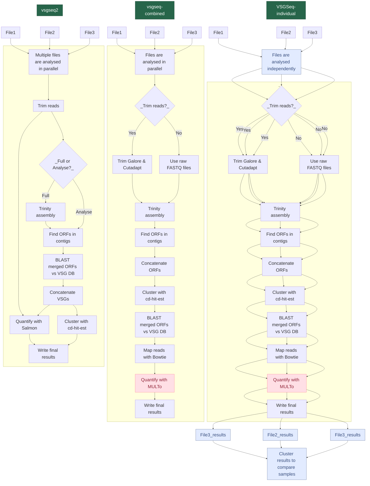

# vsgseq2

An updated pipeline for analyzing VSG-seq data. The original VSGSeq pipeline is described in this [paper](https://www.ncbi.nlm.nih.gov/pmc/articles/PMC4514441/) and [repository](https://github.com/mugnierlab/VSGSeqPipeline).

## Installation and Environment Setup

We use Nextflow to run vsgseq2 analysis. You can install Nextflow via the manual vsgseq2 installation method.

1) Manual installation with conda used to install dependencies:

```
git clone https://github.com/goldrieve/vsgseq2
cd vsgseq2/
conda env create -f vsgseq2.yml
nextflow run main.nf --help
```

2) Installation via Nextflow

Nextflow can directly install vsgseq2 with the help of Docker, Singularity or Conda to install dependencies. Without cloning the vsgseq2 github, run:

```
conda create --name nf-env bioconda::nextflow
nextflow run goldrieve/vsgseq2 -r main --help
```

Either way, you can test the installation with synthetic VSGSeq data:

```
wget https://github.com/goldrieve/vsgseq2/raw/refs/heads/main/data/reads.tar.gz
tar -xzf reads.tar.gz
cd reads
```

Once you have navigated to the synthetic reads directory, run vsgseq2 on the data with the provided samplesheet. Here we use Docker, Conda and Singularity are also options which we describe below.

```
nextflow run goldrieve/vsgseq2 -r main -with-docker --samplesheet samples.csv
```

This will create the directory __tutorial_results__ which will contain 4 subdirectories

1) VSGs 
- VSGs predicted for each sample (e.g. 1_VSGs.fasta).  
- concatenated list of all assembled VSGs (concatenated_vsgs.fasta). 
- final VSG database, after removing duplicate VSGs with cd-hit (VSGome.fasta).

2) assemblies 
- Trinity assembly for each sample.

3) summary 
- salmon alignment information (multiqc_report.html).
- quantification summary for each sample (tpm.csv).
- predicted VSG count for each sample (vsg_count.csv).

4) trimmed_reads 
- trimmed reads for each sample.

To visualise the expression data and number of assembled VSGs, use the R script bin/plot_script.R
Running the code will produce the figure below


## vsgseq2 structure
The dag below summarises each step of vsgseq2.



## Customising analysis
It is possible to run sections of vsgseq2 using the --mode flag. The default is to run the whole pipeline, but say you have assembled the transcripts during a first run and wish to change a single flag in the analysis section, you can feed in the pre-assembled transcripts and start the pipeline from the analysis section. 

The default tutorial data run, including all vsgseq2 steps:
```
nextflow run goldrieve/vsgseq2 -r main --outdir tutorial_results
```

This is the same as running:
```
nextflow run goldrieve/vsgseq2 -r main --outdir tutorial_results --mode full
```

To run the entire analysis steps, post assembly:
```
nextflow run goldrieve/vsgseq2 -r main --outdir tutorial_results --mode analyse
```

## Edit the pipeline execution using the following flags
```
VSGSEQ2.nf: A pipeline for analysing VSGSeq data

Required arguments:

  --assemblies Location of assemblies
                [default: data/tutorial_assemblies/*_trinity.Trinity.fasta]
  --vsg_db    Location of VSGdb
                [default: data/blastdb/concatAnTattb427.fa]
  --notvsg_db Location of NOTVSGdb
                [default: data/blastdb/NOTvsgs.fa]
  --vsgome    Location of VSGome
                [default: data/blastdb/concatAnTattb427.fa]
  --full_vsg_db    Location of a database to add into the VSGome (such as data/blastdb/concatAnTattb427_full.fa).
                    Default will only include the assembled VSGome.
  --mode    The mode to run the pipeline in. Options are full, assemble, predictvsgs, quantify, analyse.
                [default: full]


Optional arguments:

  --requestedcpus  Define number of cores VSGSeq2 will use.
                [default: 4]
  --cores  Define number of cores Trinity and other tools will use.
                [default: 4]
  --trinitymem  Define memory amount for Trinity in Gb.
                [default: 20 Gb]
  --cdslength    Define minimum CDS length (amino acids).
                [default: 300]
  --cdhitid       Define sequence identity threshold - how much the alignment has to match (0.0 - 1.0).
                [default: 0.98]
  --outdir        VSGSeq output directory.
                [default: results]
  --samplesheet  Define the path to the samplesheet.
                [default: samplesheet.csv]
  --help         Print this message.
  ```